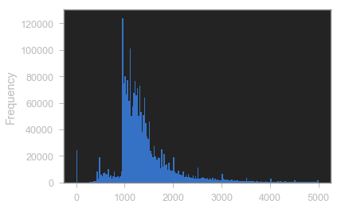
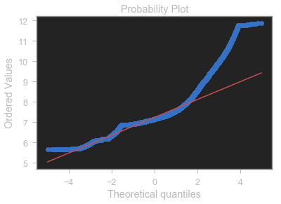
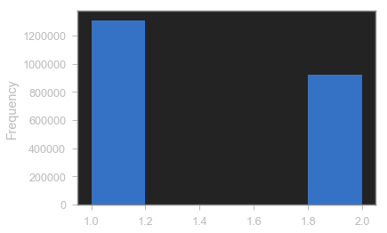
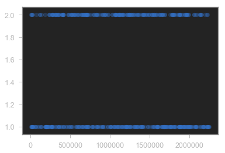

## Desafio_1

Agora vamos praticas tudo o que aprendemos no módulo 1 utilizando dados reais do CAGED (Cadastro Geral de Empregados e Desempregados)

<br>

<br>

O Cadastro Geral de Empregados e Desempregados (CAGED) foi criado como registro permanente de admissões e dispensa de empregados, sob o regime da Consolidação das Leis do Trabalho (CLT).

É utilizado pelo Programa de Seguro-Desemprego, para conferir os dados referentes aos vínculos trabalhistas, além de outros programas sociais.

Este Cadastro serve, ainda, como base para a elaboração de estudos, pesquisas, projetos e programas ligados ao mercado de trabalho, ao mesmo tempo em que subsidia a tomada de decisões para ações governamentais.

Visite o sitee do CAGED através [deste link](http://trabalho.gov.br/trabalhador-caged/2015-09-10-17-46-22) e acesse os dados clicando inicialemente em **ESTATÍSTICA** e depois em **MICRODADOS**, então acesse a base de dados do CAGED e baixe o último arquivo do ano de 2018 **CAGEDEST_122018.7z**. Além disso, baize também o arquivo **CAGEDEST_layout_Atualizado.xls** para o dicionário de dados.

Após isso, podemos começar as nossas análises:

1. **Importar as bibliotecas** e ler os dados: Importe as bibliotecas necessárias e verifique a cara dos dados e suas informações básicas dos conteúdos das colunas.

2. Limpeza e transformação da variável alvo **Salário Mensal**: verifique o tipo de dado da variával Salário Mensal, faça as devidas mudanças, plote a distribuição e dispersão dos dados e aplique a transformação matemática para a correção da assimetria.

3. Verificação dos dados da variável **Idade**: verifique os dados da variável Idade, plote uma distribuição e uma dispersão, calcule a correlação com a variável salário mensal e interprete os resultados.

4. Verificação dos dados da variável **Grau de Instrução**: verifique os dados da variável Grau de instrução, plote uma distribuição e uma dispersão, calcule a correlação com a variável salário mensal e interprete os resultados.

5. Verificação dos dados da variável **Sexo**: verifique os dados da variável Sexo, plote uma distribuição e uma dispersão, calcule a correlação com a variável salário mensal e interprete os resultados. Depois disso, faça uma inferência estatística pra verificar se os homens ganham mais que as mulheres.

6. Verificação dos dados da variável **Raça Cor**: verifique os dados da variável Raça Cor, plote uma distribuição e uma dispersão, calcule a correlação com a variável salário mensal e interprete os resultados. Depois disso, faça uma inferência estatística pra verificar se os brancos ganham mais que os outros grupos étnicos.

7. Elaborar uma hipótese para ser rejeitada ou não-rejeitada por você de acordo com o resultado da sua análise, através da utilização dos dados do CAJED considerando as suas colunas.

8. Avançado: plote um SEABORN heatmap com **todas as correlações das variávies numéricas entre si**. 

9. Avançado: Plote uma **regressão múltipla**.


```python
import pandas as pd
import warnings
import numpy as np
import matplotlib.pyplot as plt
import scipy
warnings.filterwarnings("ignore")
```


```python
data = pd.read_csv('C:/Users/Manfredi/Google Drive/Digital House/Aulas/08 Desafio 1-20190724/CAGEDEST_122018.txt'
                   , delimiter=';'
                   , usecols=[9, 12, 15, 16, 18], encoding='latin-1') 
```


```python
data.columns # usecols=[9, 12, 15, 16, 18]
```


    Index(['Grau Instrução', 'Idade', 'Raça Cor', 'Salário Mensal', 'Sexo'], dtype='object')


```python
data.shape
```


    (2256752, 5)


```python
data.head(5)
```


<div>
<style scoped>
    .dataframe tbody tr th:only-of-type {
        vertical-align: middle;
    }

    .dataframe tbody tr th {
        vertical-align: top;
    }

    .dataframe thead th {
        text-align: right;
    }
</style>
<table border="1" class="dataframe">
  <thead>
    <tr style="text-align: right;">
      <th></th>
      <th>Grau Instrução</th>
      <th>Idade</th>
      <th>Raça Cor</th>
      <th>Salário Mensal</th>
      <th>Sexo</th>
    </tr>
  </thead>
  <tbody>
    <tr>
      <th>0</th>
      <td>6</td>
      <td>24</td>
      <td>8</td>
      <td>000954,00</td>
      <td>1</td>
    </tr>
    <tr>
      <th>1</th>
      <td>8</td>
      <td>25</td>
      <td>2</td>
      <td>002500,00</td>
      <td>1</td>
    </tr>
    <tr>
      <th>2</th>
      <td>2</td>
      <td>55</td>
      <td>8</td>
      <td>000000,00</td>
      <td>1</td>
    </tr>
    <tr>
      <th>3</th>
      <td>2</td>
      <td>52</td>
      <td>8</td>
      <td>000000,00</td>
      <td>1</td>
    </tr>
    <tr>
      <th>4</th>
      <td>2</td>
      <td>32</td>
      <td>8</td>
      <td>000000,00</td>
      <td>1</td>
    </tr>
  </tbody>
</table>
</div>


```python
# RENOMEANDO A COLUNA Salário Mensal PARA Salario_Mensal
data.rename(columns={"Salário Mensal": "Salario_Mensal"}, inplace=True)
```


```python
# Substituindo a virgula pelo ponto na coluna Salario_Mensal
data['Salario_Mensal'] = [x.replace(',', '.') for x in data['Salario_Mensal']]
```


```python
# Transformando o type de Salario_Mensal para float
data['Salario_Mensal'] = data['Salario_Mensal'].astype(float)
data['Salario_Mensal'].dtypes
```


    dtype('float64')


```python
# CONTAGEM DE SALÁRIOS
data.Salario_Mensal.value_counts(ascending=False)
```


    954.0      95704
    1500.0     24390
    1200.0     24382
    0.0        24245
    1050.0     18745
    1300.0     17894
    1110.0     17597
    1108.0     16460
    1000.0     15681
    477.0      15585
    1100.0     14865
    1185.0     12988
    2000.0     12105
    1405.0     10886
    1400.0     10795
    1800.0     10561
    1150.0     10471
    1752.0      8980
    1250.0      8815
    1600.0      8792
    1440.0      8300
    1107.0      8288
    1020.0      8135
    1030.0      7988
    997.0       7865
    1194.0      7822
    990.0       7606
    2500.0      7306
    977.0       6843
    1396.0      6826
               ...  
    8978.0         1
    14832.0        1
    23811.0        1
    14830.0        1
    14829.0        1
    14827.0        1
    14818.0        1
    8979.0         1
    8970.0         1
    14862.0        1
    23827.0        1
    14864.0        1
    14917.0        1
    14914.0        1
    14904.0        1
    14903.0        1
    14902.0        1
    14901.0        1
    14895.0        1
    14894.0        1
    14888.0        1
    14883.0        1
    14877.0        1
    14876.0        1
    14874.0        1
    14873.0        1
    14872.0        1
    8965.0         1
    8967.0         1
    23584.0        1
    Name: Salario_Mensal, Length: 16987, dtype: int64


```python
data.Salario_Mensal.plot.hist(bins=200, range=(-1, 5000))
```


    <matplotlib.axes._subplots.AxesSubplot at 0x2b5c622cdd8>





```python
sample = data.sample(50000)
plt.scatter(y=sample.Salario_Mensal, x=sample.Salario_Mensal.index, alpha=0.5)
plt.title('ditribuição de salário')
plt.xlabel('índice')
plt.ylabel('salário')
plt.show()
```


```python
data.shape
```


    (2256752, 5)


```python
# Foi observado nos gráficos acima que existe uma quantidade baixa de salários zerados
# E em relação a base ela equivale a 1% dos registros totais apenas.
salario_zerado = data['Salario_Mensal'] == 0
dfsalario_zerado = data[salario_zerado]
porcentagem_zerado = (dfsalario_zerado.Salario_Mensal.value_counts() / data.shape[0]) * 100
print(porcentagem_zerado)
```

    0.0    1.074332
    Name: Salario_Mensal, dtype: float64
    


```python
# ANÁLISE DOS SALÁRIOS MAIORES QUE 60K
maiorque60k = (data['Salario_Mensal'] > 60000)
dataframe60k = data[maiorque60k]
dataframe60k.shape
#dataframe60k.Salario_Mensal.value_counts().head(20)
# Manti os salários acima de 60k pois em minha opnião estes valores são reais
```


    (353, 5)


```python
# PLOTANDO O HISTOGRAMA DOS SALÁRIOS ACIMA DE 60K
dataframe60k.Salario_Mensal.plot.hist(bins=50)
```


    <matplotlib.axes._subplots.AxesSubplot at 0x2b5c4859da0>


```python
plt.scatter(y=dataframe60k.Salario_Mensal, x=dataframe60k.Salario_Mensal.index, alpha=0.5)
plt.title('distribuição de salários acima de 60k')
plt.xlabel('Índices')
plt.ylabel('Salários')
```


    Text(0, 0.5, 'Salários')


```python
# Removendo os valores zerados
maiorque0 = data['Salario_Mensal'] > 0
dataframe = data[maiorque0]
dataframe.shape
```


    (2232507, 5)


```python
# PLOTANDO O HISTOGRAMA SEM OS OUTLIERS
dataframe.Salario_Mensal.plot.hist(bins=100, range=(-1, 5000))
```


    <matplotlib.axes._subplots.AxesSubplot at 0x2b5c62c8a90>


```python
# PLOTANDO A DISPERSÃO SEM OS OUTLIERS
sample = dataframe.sample(50000)
plt.scatter(y=sample.Salario_Mensal, x=sample.Salario_Mensal.index, alpha=0.5)
plt.title('distribuição de salário')
plt.xlabel('índice')
plt.ylabel('salário')
plt.show
```


    <function matplotlib.pyplot.show(*args, **kw)>


```python
# APLICANDO O LOG PARA CORRIGIR A CURVA
dataframe['log_salario'] = np.log1p(dataframe['Salario_Mensal'])
dataframe['log_salario'].plot.hist(bins=50, xlim=(0, 20))

# jogada do log é: torturar os dados e acaba tendo uma interpretação em percentual dos dados
# e não mais em nível (valor absoluto / valor real)
```


    <matplotlib.axes._subplots.AxesSubplot at 0x2b5c656e828>


## Teste de normalidade Salario_Mensal


```python
import seaborn as sns
from scipy import stats

sns.distplot(dataframe['log_salario'], fit=stats.norm)

(media, desviopadrao) = stats.norm.fit(dataframe['log_salario'])
print(f'media = {media:.2f} and desvio padrao = {desviopadrao:.2f}')
plt.legend(['Normal dist. ($\mu=$ {:.2f} and $\sigma=$ {:.2f} )'.format(media, desviopadrao)],
            loc='best')
plt.ylabel('Frequencia')
plt.title('Distribuição de salário')

fig = plt.figure()
res = stats.probplot(dataframe['log_salario'], plot=plt)
plt.show()
```

    media = 7.24 and desvio padrao = 0.47
    





### 3 - Verificação dos dados da variável Idade: verifique os dados da variável Idade, plote uma distribuição e uma dispersão, calcule a correlação com a variável salário mensal e interprete os resultados.


```python
# Analisando menores de idade
menor18 = dataframe['Idade'] < 18
dataframemenor18 = dataframe[menor18]
dataframemenor18.Idade.value_counts()
```


    17    25047
    16    14511
    15     5075
    14      701
    10       15
    11        9
    12        7
    13        6
    Name: Idade, dtype: int64


```python
# PLOTANDO O HISTOGRAMA DE IDADES
dataframe.Idade.plot.hist(bins=100, range=(10, 110))
```


    <matplotlib.axes._subplots.AxesSubplot at 0x2b5c4fd3518>


```python
# Pegando uma amostra de 50k de idade e plotando o gráfico de dispersão
sample = dataframe.sample(50000)
plt.scatter(y=sample.Idade, x=sample.Idade.index, alpha=0.5)
plt.title('distribuição de idade')
plt.ylabel('Idade')
plt.xlabel('Índice')
plt.show
```


    <function matplotlib.pyplot.show(*args, **kw)>


## Cálculando a correlação de idade e salário


```python
dfidadevssalario = dataframe[['Idade', 'Salario_Mensal']]
print(dfidadevssalario.corr().round(2))
print()
print('Aqui quer dizer que a correlação entre idade e salario_mensal é bem fraca (0.00 a 0.19) ou seja')
print('se uma variável sobe ou desce, não quer dizer que a outra fará o mesmo')
```

                    Idade  Salario_Mensal
    Idade            1.00            0.15
    Salario_Mensal   0.15            1.00
    
    Aqui quer dizer que a correlação entre idade e salario_mensal é bem fraca (0.00 a 0.19) ou seja
    se uma variável sobe ou desce, não quer dizer que a outra fará o mesmo
    

### 4 Verificação dos dados da variável Grau de Instrução: verifique os dados da variável Grau de instrução, plote uma distribuição e uma dispersão, calcule a correlação com a variável salário mensal e interprete os resultados.

### Tabela grau de instrução

* Analfabeto_______________1
* Até 5ª Incompleto	_______2
* 5ª Completo Fundamental__3
* 6ª a 9ª Fundamental______4
* Fundamental Completo_____5
* Médio Incompleto_________6
* Médio Completo___________7
* Superior Incompleto______8
* Superior Completo________9
* MESTRADO________________10
* DOUTORADO_______________11
* IGNORADO________________-1


```python
# RENOMEANDO A COLUNA GRAU INSTRUÇÃO PARA Grau_Instrucao
dataframe.rename(columns={'Grau Instrução': 'Grau_Instrucao'}, inplace=True)
```


```python
# TROCANDO O TIPO PRIMITIVO DE GRAU_INSTRUCAO PARA STRING
dataframe['Grau_Instrucao_STR'] = dataframe.Grau_Instrucao.astype(str, inplace=True)
```


```python
# VERIFICANDO SE O TIPO PRIMITIVO FOI TROCADO
dataframe['Grau_Instrucao_STR'].dtype
```


    dtype('O')


```python
# https://pandas.pydata.org/pandas-docs/stable/reference/api/pandas.DataFrame.replace.html
dataframe.Grau_Instrucao_STR.replace({'1': 'Analfabeto',
                              '2': 'Até 5ª Incompleto',
                              '3': '5ª Completo Fundamental',
                              '4': '6ª a 9ª Fundamental',
                              '5': 'Fundamental Completo',
                              '6': 'Médio Incompleto',
                              '7': 'Médio Completo',
                              '8': 'Superior Incompleto',
                              '9': 'Superior Completo',
                              '10': 'Mestrado',
                              '11': 'Doutorado',
                              '-1': 'IGNORADO'}, inplace=True)
```


```python
dataframe.head()
```


<div>
<style scoped>
    .dataframe tbody tr th:only-of-type {
        vertical-align: middle;
    }

    .dataframe tbody tr th {
        vertical-align: top;
    }

    .dataframe thead th {
        text-align: right;
    }
</style>
<table border="1" class="dataframe">
  <thead>
    <tr style="text-align: right;">
      <th></th>
      <th>Grau_Instrucao</th>
      <th>Idade</th>
      <th>Raça Cor</th>
      <th>Salario_Mensal</th>
      <th>Sexo</th>
      <th>log_salario</th>
      <th>Grau_Instrucao_STR</th>
    </tr>
  </thead>
  <tbody>
    <tr>
      <th>0</th>
      <td>6</td>
      <td>24</td>
      <td>8</td>
      <td>954.0</td>
      <td>1</td>
      <td>6.861711</td>
      <td>Médio Incompleto</td>
    </tr>
    <tr>
      <th>1</th>
      <td>8</td>
      <td>25</td>
      <td>2</td>
      <td>2500.0</td>
      <td>1</td>
      <td>7.824446</td>
      <td>Superior Incompleto</td>
    </tr>
    <tr>
      <th>7</th>
      <td>4</td>
      <td>50</td>
      <td>2</td>
      <td>1061.0</td>
      <td>2</td>
      <td>6.967909</td>
      <td>6ª a 9ª Fundamental</td>
    </tr>
    <tr>
      <th>11</th>
      <td>7</td>
      <td>22</td>
      <td>8</td>
      <td>1061.0</td>
      <td>1</td>
      <td>6.967909</td>
      <td>Médio Completo</td>
    </tr>
    <tr>
      <th>12</th>
      <td>7</td>
      <td>37</td>
      <td>2</td>
      <td>1061.0</td>
      <td>1</td>
      <td>6.967909</td>
      <td>Médio Completo</td>
    </tr>
  </tbody>
</table>
</div>


```python
# VERIFICANDO A DISPERSÃO DE IDADE
sample = dataframe.sample(2000)
plt.scatter(y=sample.Grau_Instrucao, x=sample.Grau_Instrucao.index, alpha=0.4)
```


    <matplotlib.collections.PathCollection at 0x2b5f1d03d68>


```python
# CRIANDO UM HISTOGRAMA
dataframe.Grau_Instrucao.plot.hist(bins=20, range=(0, 10))
```


    <matplotlib.axes._subplots.AxesSubplot at 0x2b5c5119240>


```python
dataframe.Grau_Instrucao_STR.value_counts().plot(kind='bar')
```


    <matplotlib.axes._subplots.AxesSubplot at 0x2b5c50bd3c8>


```python
# FAZENDO A CORRELAÇÃO ENTRE A VARIÁVEL GRAU INSTRUÇÃO E SALÁRIO
dfgrauinstrucaovssalario = dataframe[['Grau_Instrucao', 'Salario_Mensal']]
print(dfgrauinstrucaovssalario.corr().round(2))
print()
print('Aqui quer dizer que a correlação entre Grau_Instrucao e Salario_Mensal é bem fraca (0.00 a 0.19) ou seja')
print('se uma variável sobe ou desce, não quer dizer que a outra fará o mesmo')
```

                    Grau_Instrucao  Salario_Mensal
    Grau_Instrucao            1.00            0.19
    Salario_Mensal            0.19            1.00
    
    Aqui quer dizer que a correlação entre Grau_Instrucao e Salario_Mensal é bem fraca (0.00 a 0.19) ou seja
    se uma variável sobe ou desce, não quer dizer que a outra fará o mesmo
    

### 5 Verificação dos dados da variável Sexo: verifique os dados da variável Sexo, plote uma distribuição e uma dispersão, calcule a correlação com a variável salário mensal e interprete os resultados. Depois disso, faça uma inferência estatística pra verificar se os homens ganham mais que as mulheres.


```python
# No dataset existem mais homens do que mulheres
dataframe.Sexo.value_counts()
```


    1    1310312
    2     922195
    Name: Sexo, dtype: int64


### DICIONÁRIO DADOS SEXO
* 1 = MASCULINO
* 2 = FEMININO


```python
# Criando uma nova coluna e transformando os dados para string
dataframe['Sexo_STR'] = dataframe.Sexo.astype(str)
```


```python
# Alterando os valores 1 para Masculino e 2 para Feminino
dataframe.Sexo_STR.replace({'1': 'Masculino',
                            '2': 'Feminino'}, inplace=True)
```


```python
dataframe.head()
```


<div>
<style scoped>
    .dataframe tbody tr th:only-of-type {
        vertical-align: middle;
    }

    .dataframe tbody tr th {
        vertical-align: top;
    }

    .dataframe thead th {
        text-align: right;
    }
</style>
<table border="1" class="dataframe">
  <thead>
    <tr style="text-align: right;">
      <th></th>
      <th>Grau_Instrucao</th>
      <th>Idade</th>
      <th>Raça Cor</th>
      <th>Salario_Mensal</th>
      <th>Sexo</th>
      <th>log_salario</th>
      <th>Grau_Instrucao_STR</th>
      <th>Sexo_STR</th>
    </tr>
  </thead>
  <tbody>
    <tr>
      <th>0</th>
      <td>6</td>
      <td>24</td>
      <td>8</td>
      <td>954.0</td>
      <td>1</td>
      <td>6.861711</td>
      <td>Médio Incompleto</td>
      <td>Masculino</td>
    </tr>
    <tr>
      <th>1</th>
      <td>8</td>
      <td>25</td>
      <td>2</td>
      <td>2500.0</td>
      <td>1</td>
      <td>7.824446</td>
      <td>Superior Incompleto</td>
      <td>Masculino</td>
    </tr>
    <tr>
      <th>7</th>
      <td>4</td>
      <td>50</td>
      <td>2</td>
      <td>1061.0</td>
      <td>2</td>
      <td>6.967909</td>
      <td>6ª a 9ª Fundamental</td>
      <td>Feminino</td>
    </tr>
    <tr>
      <th>11</th>
      <td>7</td>
      <td>22</td>
      <td>8</td>
      <td>1061.0</td>
      <td>1</td>
      <td>6.967909</td>
      <td>Médio Completo</td>
      <td>Masculino</td>
    </tr>
    <tr>
      <th>12</th>
      <td>7</td>
      <td>37</td>
      <td>2</td>
      <td>1061.0</td>
      <td>1</td>
      <td>6.967909</td>
      <td>Médio Completo</td>
      <td>Masculino</td>
    </tr>
  </tbody>
</table>
</div>


```python
# Plotando o gráfico de distribuição
dataframe.Sexo.plot.hist(bins=5, range=(1, 2))
```


    <matplotlib.axes._subplots.AxesSubplot at 0x2b5c6e2c7f0>





```python
# Plotando o gráfico de dispersão
sample = dataframe.sample(500)
plt.scatter(y=sample.Sexo, x=sample.Sexo.index, alpha=0.3)
```


    <matplotlib.collections.PathCollection at 0x2b58112f780>





```python
# Calculando a correlação de salario_mensal com sexo
dfsexovssalariomensal = dataframe[['Sexo', 'Salario_Mensal']]
print(dfsexovssalariomensal.corr().round(2))
print()
print('A correlação entre as variáveis Sexo e Salário Mensal são bem fracas')
```

                    Sexo  Salario_Mensal
    Sexo            1.00           -0.04
    Salario_Mensal -0.04            1.00
    
    A correlação entre as variáveis Sexo e Salário Mensal são bem fracas
    


```python
dfsexovssalariomensal.groupby('Sexo').mean()
```


<div>
<style scoped>
    .dataframe tbody tr th:only-of-type {
        vertical-align: middle;
    }

    .dataframe tbody tr th {
        vertical-align: top;
    }

    .dataframe thead th {
        text-align: right;
    }
</style>
<table border="1" class="dataframe">
  <thead>
    <tr style="text-align: right;">
      <th></th>
      <th>Salario_Mensal</th>
    </tr>
    <tr>
      <th>Sexo</th>
      <th></th>
    </tr>
  </thead>
  <tbody>
    <tr>
      <th>1</th>
      <td>1718.585699</td>
    </tr>
    <tr>
      <th>2</th>
      <td>1540.241696</td>
    </tr>
  </tbody>
</table>
</div>


```python
dataframe.head()
```


<div>
<style scoped>
    .dataframe tbody tr th:only-of-type {
        vertical-align: middle;
    }

    .dataframe tbody tr th {
        vertical-align: top;
    }

    .dataframe thead th {
        text-align: right;
    }
</style>
<table border="1" class="dataframe">
  <thead>
    <tr style="text-align: right;">
      <th></th>
      <th>Grau_Instrucao</th>
      <th>Idade</th>
      <th>Raça Cor</th>
      <th>Salario_Mensal</th>
      <th>Sexo</th>
      <th>log_salario</th>
      <th>Grau_Instrucao_STR</th>
      <th>Sexo_STR</th>
    </tr>
  </thead>
  <tbody>
    <tr>
      <th>0</th>
      <td>6</td>
      <td>24</td>
      <td>8</td>
      <td>954.0</td>
      <td>1</td>
      <td>6.861711</td>
      <td>Médio Incompleto</td>
      <td>Masculino</td>
    </tr>
    <tr>
      <th>1</th>
      <td>8</td>
      <td>25</td>
      <td>2</td>
      <td>2500.0</td>
      <td>1</td>
      <td>7.824446</td>
      <td>Superior Incompleto</td>
      <td>Masculino</td>
    </tr>
    <tr>
      <th>7</th>
      <td>4</td>
      <td>50</td>
      <td>2</td>
      <td>1061.0</td>
      <td>2</td>
      <td>6.967909</td>
      <td>6ª a 9ª Fundamental</td>
      <td>Feminino</td>
    </tr>
    <tr>
      <th>11</th>
      <td>7</td>
      <td>22</td>
      <td>8</td>
      <td>1061.0</td>
      <td>1</td>
      <td>6.967909</td>
      <td>Médio Completo</td>
      <td>Masculino</td>
    </tr>
    <tr>
      <th>12</th>
      <td>7</td>
      <td>37</td>
      <td>2</td>
      <td>1061.0</td>
      <td>1</td>
      <td>6.967909</td>
      <td>Médio Completo</td>
      <td>Masculino</td>
    </tr>
  </tbody>
</table>
</div>


```python
# Criando uma coluna do log padronizado (distribuição padronizada) ou seja, transformando os valores do log
# em score-z
dataframe['log_padronizado_scorez'] = ( dataframe['log_salario'] - dataframe['log_salario'].mean() ) / dataframe['log_salario'].std() 
```


```python
# Criando um dataframe só de homens
homens = dataframe['Sexo'] == 1
dataframehomens = dataframe[homens]
```


```python
# Criando um dataframe só de mulheres
mulheres = dataframe['Sexo'] == 2
dataframemulheres = dataframe[mulheres]
```


```python
# Criando uma coluna com o score-z do log para os homens
dataframehomens['log_padronizado_salario_homens'] = ( dataframehomens['log_salario'] - dataframehomens['log_salario'].mean() ) / ( dataframehomens['log_salario'].std() ) 
```


```python
# Criando uma coluna com o score-z do log para as mulheres
dataframemulheres['log_padronizado_salario_mulheres'] = ( dataframemulheres['log_salario'] - dataframemulheres['log_salario'].mean() ) / ( dataframemulheres['log_salario'].std() )                  
```


```python
# Calculando a média e o desvio padrão dos homens
mediapadronizadahomens = dataframehomens['log_padronizado_salario_homens'].mean()
desviopadraopadronizadohomens = dataframehomens['log_padronizado_salario_homens'].std()
mediapadronizadahomens, desviopadraopadronizadohomens
```


    (2.5932579894274958e-11, 1.0000000000003053)


```python
# Calculando a média e o desvio padrão das mulheres
mediapadronizadamulheres = dataframemulheres['log_padronizado_salario_mulheres'].mean()
desviopadraopadronizadomulheres = dataframemulheres['log_padronizado_salario_mulheres'].std()
mediapadronizadamulheres, desviopadraopadronizadomulheres
```


    (4.3494962263891254e-11, 0.9999999999987552)


```python

```


```python
# VERIFICANDO OS SCORE-Z
scipy.stats.norm.interval(alpha=0.95,
                          loc = mediapadronizadahomens, scale = desviopadraopadronizadohomens)
```


    (-1.9599639845147199, 1.959963984566585)


```python
salariohomemmin = dataframehomens.log_padronizado_salario_homens.round(2) == -1.96
dfsalariominhomem = dataframehomens[salariohomemmin]
salminhomem = dfsalariominhomem[['Salario_Mensal', 'log_padronizado_salario_homens']].min()
salminhomem
```


    Salario_Mensal                    565.000000
    log_padronizado_salario_homens     -1.962404
    dtype: float64


```python
salariohomemmax = dataframehomens.log_padronizado_salario_homens.round(2) == 1.96
dfsalariomaxhomem = dataframehomens[salariohomemmax]
salmaxhomem = dfsalariomaxhomem[['Salario_Mensal', 'log_padronizado_salario_homens']].max()
salmaxhomem
```


    Salario_Mensal                    3710.000000
    log_padronizado_salario_homens       1.964841
    dtype: float64


```python

```


```python
salariominmulheres = dataframemulheres.log_padronizado_salario_mulheres.round(2) == -1.96
dfsalariominmulheres = dataframemulheres[salariominmulheres]
salminmulher = dfsalariominmulheres[['Salario_Mensal', 'log_padronizado_salario_mulheres']].min()
salminmulher
```


    Salario_Mensal                      529.000000
    log_padronizado_salario_mulheres     -1.961585
    dtype: float64


```python
salariomaxmulheres = dataframemulheres.log_padronizado_salario_mulheres.round(2) == 1.96
dfsalariomaxmulheres = dataframemulheres[salariomaxmulheres]
salmaxmulher = dfsalariomaxmulheres[['Salario_Mensal', 'log_padronizado_salario_mulheres']].max()
salmaxmulher
```


    Salario_Mensal                      3266.000000
    log_padronizado_salario_mulheres       1.964688
    dtype: float64


```python
print(f'Sal min homens = {salminhomem[0]} scorez = {salminhomem[1]}')
print(f'Sal max homens {salmaxhomem[0]} scorez = {salmaxhomem[1]}')
print(f'Sal min mulheres = {salminmulher[0]} scorez = {salminmulher[1]}')
print(f'Sal max mulheres {salmaxmulher[0]} scorez = {salmaxmulher[1]}')
```

    Sal min homens = 565.0 scorez = -1.9624040027845062
    Sal max homens 3710.0 scorez = 1.9648414906536718
    Sal min mulheres = 529.0 scorez = -1.9615849341830813
    Sal max mulheres 3266.0 scorez = 1.9646875308751859
    


```python
dataframe.head(10)
```


<div>
<style scoped>
    .dataframe tbody tr th:only-of-type {
        vertical-align: middle;
    }

    .dataframe tbody tr th {
        vertical-align: top;
    }

    .dataframe thead th {
        text-align: right;
    }
</style>
<table border="1" class="dataframe">
  <thead>
    <tr style="text-align: right;">
      <th></th>
      <th>Grau_Instrucao</th>
      <th>Idade</th>
      <th>Raça Cor</th>
      <th>Salario_Mensal</th>
      <th>Sexo</th>
      <th>log_salario</th>
      <th>Grau_Instrucao_STR</th>
      <th>Sexo_STR</th>
      <th>log_padronizado_scorez</th>
    </tr>
  </thead>
  <tbody>
    <tr>
      <th>0</th>
      <td>6</td>
      <td>24</td>
      <td>8</td>
      <td>954.0</td>
      <td>1</td>
      <td>6.861711</td>
      <td>Médio Incompleto</td>
      <td>Masculino</td>
      <td>-0.793077</td>
    </tr>
    <tr>
      <th>1</th>
      <td>8</td>
      <td>25</td>
      <td>2</td>
      <td>2500.0</td>
      <td>1</td>
      <td>7.824446</td>
      <td>Superior Incompleto</td>
      <td>Masculino</td>
      <td>1.234427</td>
    </tr>
    <tr>
      <th>7</th>
      <td>4</td>
      <td>50</td>
      <td>2</td>
      <td>1061.0</td>
      <td>2</td>
      <td>6.967909</td>
      <td>6ª a 9ª Fundamental</td>
      <td>Feminino</td>
      <td>-0.569426</td>
    </tr>
    <tr>
      <th>11</th>
      <td>7</td>
      <td>22</td>
      <td>8</td>
      <td>1061.0</td>
      <td>1</td>
      <td>6.967909</td>
      <td>Médio Completo</td>
      <td>Masculino</td>
      <td>-0.569426</td>
    </tr>
    <tr>
      <th>12</th>
      <td>7</td>
      <td>37</td>
      <td>2</td>
      <td>1061.0</td>
      <td>1</td>
      <td>6.967909</td>
      <td>Médio Completo</td>
      <td>Masculino</td>
      <td>-0.569426</td>
    </tr>
    <tr>
      <th>13</th>
      <td>6</td>
      <td>20</td>
      <td>2</td>
      <td>1061.0</td>
      <td>1</td>
      <td>6.967909</td>
      <td>Médio Incompleto</td>
      <td>Masculino</td>
      <td>-0.569426</td>
    </tr>
    <tr>
      <th>14</th>
      <td>2</td>
      <td>39</td>
      <td>2</td>
      <td>1026.0</td>
      <td>1</td>
      <td>6.934397</td>
      <td>Até 5ª Incompleto</td>
      <td>Masculino</td>
      <td>-0.640002</td>
    </tr>
    <tr>
      <th>15</th>
      <td>5</td>
      <td>25</td>
      <td>8</td>
      <td>1061.0</td>
      <td>1</td>
      <td>6.967909</td>
      <td>Fundamental Completo</td>
      <td>Masculino</td>
      <td>-0.569426</td>
    </tr>
    <tr>
      <th>16</th>
      <td>5</td>
      <td>22</td>
      <td>9</td>
      <td>1061.0</td>
      <td>1</td>
      <td>6.967909</td>
      <td>Fundamental Completo</td>
      <td>Masculino</td>
      <td>-0.569426</td>
    </tr>
    <tr>
      <th>17</th>
      <td>5</td>
      <td>18</td>
      <td>8</td>
      <td>1700.0</td>
      <td>1</td>
      <td>7.438972</td>
      <td>Fundamental Completo</td>
      <td>Masculino</td>
      <td>0.422624</td>
    </tr>
  </tbody>
</table>
</div>


```python
# Vericando a curva agora do log_padronizado_scorez
dataframe['log_padronizado_scorez'].plot.hist()
```


    <matplotlib.axes._subplots.AxesSubplot at 0x2b58003e438>


```python
log_padronizado_salario = dataframe['log_padronizado_scorez']

media_padronizada_salario = np.mean(log_padronizado_salario)
desvio_padrao_log_padronizado_salario = np.std(log_padronizado_salario)
media_padronizada_salario, desvio_padrao_log_padronizado_salario
```


    (1.1029010760011298e-11, 0.9999997760371009)


```python
# z-score para a distribuição padronizada 
# significa que quem recebe menos que o z-score minimo, está abaixo da média salarial 
# e quem recebe mais que o z-score maximo está acima, tudo isso dentro de um intervalo de confiança de 95% 

# ONDE alpha é o intervalo de confiança, loc é a média e scale é o desvio padrão
scipy.stats.norm.interval(alpha=0.95,
                          loc = media_padronizada_salario, scale = desvio_padrao_log_padronizado_salario)
```


    (-1.959963545569809, 1.959963545591867)


```python
# calculando o p-value para a distribuição padronizada
# neste caso tem uma evidência sugestiva
p_value = scipy.stats.norm(media_padronizada_salario,
                 desvio_padrao_log_padronizado_salario).pdf(2 * desvio_padrao_log_padronizado_salario)
p_value
```


    0.05399097860635508


```python
# Calculando o alpha máximo
alpha_max = 1 - p_value
alpha_max
```


    0.946009021393645


```python
# Filtrando os homens com salário acima da média pelo log de salário scorez
homens_acima_media_zscore = (dataframe['log_padronizado_scorez'] > 1.9599) & (dataframe['Sexo'] == 1)
df_salario_homens_acima_media = dataframe[homens_acima_media_zscore]
```


```python
# Filtrando as mulheres com o salário acima da média pelo log de salário scorez
mulheres_acima_media_zscore = (dataframe['log_padronizado_scorez'] > 1.9599) & (dataframe['Sexo'] == 2)
df_salario_mulheres_acima_media = dataframe[mulheres_acima_media_zscore]
```


```python
# Filtrando os homens com salário abaixo da média pelo log de salário scorez
homens_abaixo_media_zscore = (dataframe['log_padronizado_scorez'] < -1.9599) & (dataframe['Sexo'] == 1)
df_salario_homens_abaixo_media = dataframe[homens_abaixo_media_zscore]
```


```python
# Filtrando as mulheres com o salário abaixo da média pelo log de salário scorez
mulheres_abaixo_media_zscore = (dataframe['log_padronizado_scorez'] < -1.9599) & (dataframe['Sexo'] == 2)
df_salario_mulheres_abaixo_media = dataframe[mulheres_abaixo_media_zscore]
```


```python
# Porcentagem de homens que recebem acima da média
( df_salario_homens_acima_media.shape[0] / dataframe[dataframe['Sexo'] == 1].shape[0] ) * 100
```


    4.659271990182491


```python
# Porcentagem de mulheres que recebem acima da média
( df_salario_mulheres_acima_media.shape[0] / dataframe[dataframe['Sexo'] == 2].shape[0] ) * 100
```


    4.000563872066103


```python
# Porcentagem de homens que recebem abaixo da média
( df_salario_homens_abaixo_media.shape[0] / dataframe[dataframe['Sexo'] == 1].shape[0] ) * 100
```


    1.7055479916233691


```python
# Porcentagem de mulheres que recebem abaixo da média
( df_salario_mulheres_abaixo_media.shape[0] / dataframe[dataframe['Sexo'] == 2].shape[0] ) * 100
```


    2.50511009059906


```python
print(f'Sal min homens = {salminhomem[0]} scorez = {salminhomem[1]}')
print(f'Sal max homens {salmaxhomem[0]} scorez = {salmaxhomem[1]}')
print(f'Sal min mulheres = {salminmulher[0]} scorez = {salminmulher[1]}')
print(f'Sal max mulheres {salmaxmulher[0]} scorez = {salmaxmulher[1]}')
```

    Sal min homens = 565.0 scorez = -1.9624040027845062
    Sal max homens 3710.0 scorez = 1.9648414906536718
    Sal min mulheres = 529.0 scorez = -1.9615849341830813
    Sal max mulheres 3266.0 scorez = 1.9646875308751859
    


```python

```


```python
scipy.stats.norm.interval(alpha=0.95, loc=mediapadronizadamulheres, scale=desviopadraopadronizadomulheres)[0] < mediapadronizadahomens < scipy.stats.norm.interval(alpha=0.95, loc=mediapadronizadamulheres, scale=desviopadraopadronizadomulheres)[1] 
```


    True


-----

## 6 Verificação dos dados da variável Raça Cor: verifique os dados da variável Raça Cor, plote uma distribuição e uma dispersão, calcule a correlação com a variável salário mensal e interprete os resultados. Depois disso, faça uma inferência estatística pra verificar se os brancos ganham mais que os outros grupos étnicos.

### Dicionário de dados Raça Cor
* INDIGENA___ 1
* BRANCA_____ 2
* PRETA______ 4
* AMARELA____ 6
* PARDA______ 8
* NÃO IDENT__ 9
* IGNORADO__ -1


```python
# Renomeando a coluna Raça Cor para Raca_Cor
dataframe.rename(columns={"Raça Cor": "Raca_Cor"},inplace=True)
```


```python
# Criando uma coluna Raca_Cor de string
dataframe['Raca_Cor_STR'] = dataframe['Raca_Cor'].astype(str, inplace=True)
```


```python
# Trocando os valores de numeros para o dicionário
dataframe.Raca_Cor_STR.replace({'1': 'Indigena',
                               '2': 'Branca',
                               '4': 'Preta',
                               '6': 'Amarela',
                               '8': 'Parda',
                               '9': 'Não Ident',
                               '-1': 'IGNORADO'}, inplace=True)
```


```python
dataframe.Raca_Cor.plot.hist(bins=10)
```


    <matplotlib.axes._subplots.AxesSubplot at 0x2b58003e8d0>


```python
# Plotando um gráfico de barras
dataframe.Raca_Cor_STR.value_counts().plot(kind='bar')
```


    <matplotlib.axes._subplots.AxesSubplot at 0x2b5a7e5fc18>


```python
sample_raca_cor = dataframe.sample(5000)
plt.scatter(y=sample_raca_cor.Raca_Cor, x=sample_raca_cor.Raca_Cor.index, alpha=0.3)
```


    <matplotlib.collections.PathCollection at 0x2b580a8d128>


```python
df_racacor_vs_salario = dataframe[['Raca_Cor', 'Salario_Mensal']]
df_racacor_vs_salario.corr().round(2)
```


<div>
<style scoped>
    .dataframe tbody tr th:only-of-type {
        vertical-align: middle;
    }

    .dataframe tbody tr th {
        vertical-align: top;
    }

    .dataframe thead th {
        text-align: right;
    }
</style>
<table border="1" class="dataframe">
  <thead>
    <tr style="text-align: right;">
      <th></th>
      <th>Raca_Cor</th>
      <th>Salario_Mensal</th>
    </tr>
  </thead>
  <tbody>
    <tr>
      <th>Raca_Cor</th>
      <td>1.00</td>
      <td>-0.08</td>
    </tr>
    <tr>
      <th>Salario_Mensal</th>
      <td>-0.08</td>
      <td>1.00</td>
    </tr>
  </tbody>
</table>
</div>


```python
# CRIANDO DATAFRAME SÓ DOS BRANCOS
filtrobrancos = dataframe['Raca_Cor_STR'] == "Branca"
dfbrancos = dataframe[filtrobrancos]
# CRIANDO DATAFRAME SÓ DOS PARDOS
filtropardos = dataframe['Raca_Cor_STR'] == "Parda"
dfpardos = dataframe[filtropardos]
# CRIANDO DATAFRAME DOS NÃO IDENTIFICADOS
filtronaoident = dataframe['Raca_Cor_STR'] == "Não Ident"
dfnaoident = dataframe[filtronaoident]
# CRIANDO DATAFRAME SÓ DOS PRETOS
filtropretas = dataframe['Raca_Cor_STR'] == "Preta"
dfpretas = dataframe[filtropretas]
# CRIANDO DATAFRAME SÓ DOS AMARELOS
filtroamarelas = dataframe['Raca_Cor_STR'] == "Amarela"
dfamarelos = dataframe[filtroamarelas]
# CRIANDO DATAFRAME INDIGENA
filtroindigena = dataframe['Raca_Cor_STR'] == "Indigena"
dfindigenas = dataframe[filtroindigena]
```


```python
# CALCULANDO AS MÉDIAS E DESVIOS PADRÃO
# BRANCOS
mediadfbrancos = dfbrancos.log_salario.mean()
dpbrancos = dfbrancos.log_salario.std()
# PARDOS
mediapardos = dfpardos.log_salario.mean()
dppardos = dfpardos.log_salario.std()
# NÃO IDENTIFICADOS
medianaoident = dfnaoident.log_salario.mean()
dpnaoident = dfnaoident.log_salario.std()
# PRETOS
mediapretas = dfpretas.log_salario.mean()
dppretas = dfpretas.log_salario.std()
# AMARELOS
mediaamarelos = dfamarelos.log_salario.mean()
dpamarelos = dfamarelos.log_salario.std()
# INDIGENAS
mediaindigenas = dfindigenas.log_salario.mean()
dpindigenas = dfindigenas.log_salario.std()

```


```python
print(f'brancos media= {mediadfbrancos} dp= {dpbrancos}')
print(f'pardos media= {mediapardos} dp= {dppardos}')
print(f'nao ident media= {medianaoident} dp= {dpnaoident}')
print(f'pretas media= {mediapretas} dp= {dppretas}')
print(f'amarelas media= {mediaamarelos} dp= {dpamarelos}')
print(f'indigenas media= {mediaindigenas} dp= {dpindigenas}')
```

    brancos media= 7.308393959282515 dp= 0.5284640425226509
    pardos media= 7.174311717051291 dp= 0.4209856968436536
    nao ident media= 7.203077439726465 dp= 0.4181268102920843
    pretas media= 7.1830787667184115 dp= 0.3938784615271023
    amarelas media= 7.350754899909039 dp= 0.6416893634546512
    indigenas media= 7.291292841834495 dp= 0.5208979985339196
    


```python
print(stats.norm.interval(0.95, loc=mediaindigenas, scale=dpindigenas)[0])
print(stats.norm.interval(0.95, loc=mediadfbrancos, scale=dpbrancos)[0])
```

    6.270351525089015
    6.272623468813676
    


```python
x = np.linspace(mediadfbrancos - 3*dpbrancos, mediadfbrancos + 3*dpbrancos, 100)

fig, ax = plt.subplots(1, 1)
ax.plot(x, stats.norm.pdf(x, mediadfbrancos, dpbrancos),label='Brancos')
ax.plot(x, stats.norm.pdf(x, mediapretas, dppretas),label='Pretas')
ax.legend(loc='best', frameon=False)
```


    <matplotlib.legend.Legend at 0x2b5a7e5f9b0>


```python
# BRANCOS VS PRETAS
scipy.stats.norm.interval(alpha=0.95, loc=mediadfbrancos, scale=dpbrancos)[0] < mediapretas < scipy.stats.norm.interval(alpha=0.95, loc=mediadfbrancos, scale=dpbrancos)[1] 
```


    True


```python
# PRETAS VS BRANCOS
scipy.stats.norm.interval(alpha=0.95, loc=mediapretas, scale=dppretas)[0] < mediadfbrancos < scipy.stats.norm.interval(alpha=0.95, loc=mediapretas, scale=dppretas)[1] 
```


    True


```python
# BRANCOS VS INDIGENAS
scipy.stats.norm.interval(alpha=0.95, loc=mediadfbrancos, scale=dpbrancos)[0] < mediaindigenas < scipy.stats.norm.interval(alpha=0.95, loc=mediadfbrancos, scale=dpbrancos)[1] 
```


    True


```python
# INDIGENAS VS BRANCOS
scipy.stats.norm.interval(alpha=0.95, loc=mediaindigenas, scale=dpindigenas)[0] < mediadfbrancos < scipy.stats.norm.interval(alpha=0.95, loc=mediaindigenas, scale=dpindigenas)[1] 
```


    True


```python
# BRANCOS VS PARDAS
scipy.stats.norm.interval(alpha=0.95, loc=mediadfbrancos, scale=dpbrancos)[0] < mediapardos < scipy.stats.norm.interval(alpha=0.95, loc=mediadfbrancos, scale=dpbrancos)[1] 
```


    True


```python
# PARDAS VS BRANCOS
scipy.stats.norm.interval(alpha=0.95, loc=mediapardos, scale=dppardos)[0] < mediadfbrancos < scipy.stats.norm.interval(alpha=0.95, loc=mediapardos, scale=dppardos)[1] 
```


    True


## 8 Avançado: plote um SEABORN heatmap com todas as correlações das variávies numéricas entre si.


```python
heat_map = sns.heatmap(dataframe.corr())
plt.show()
```


```python

```


```python

```
