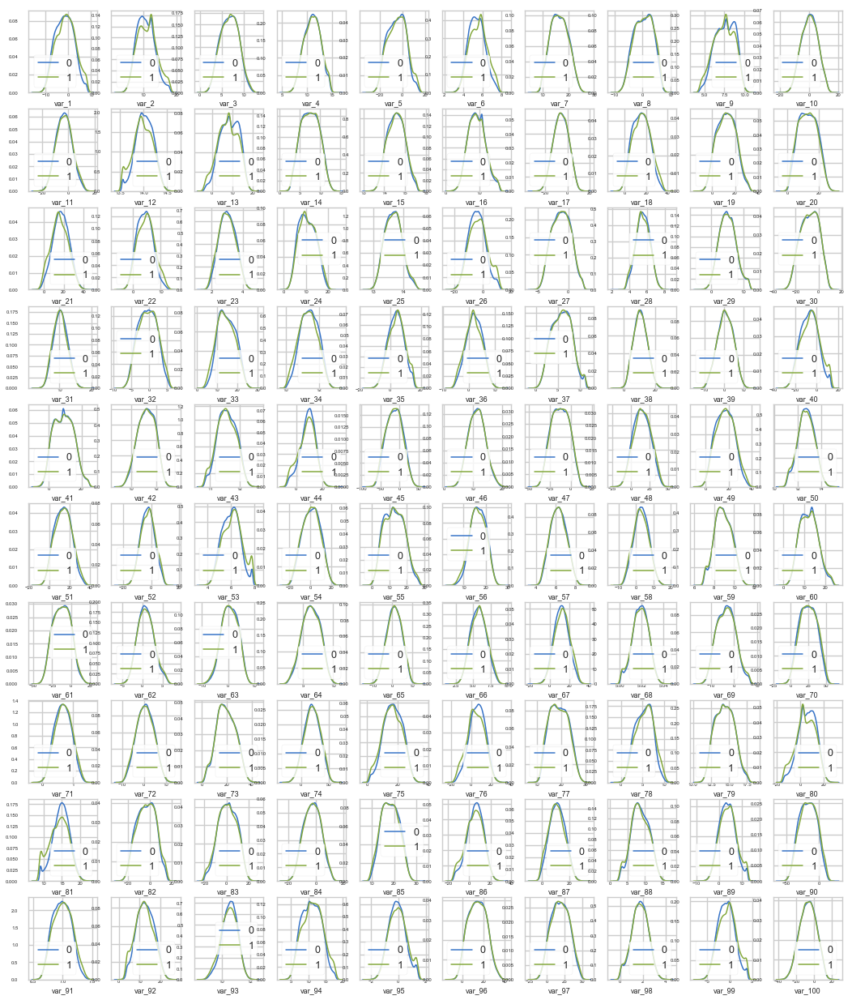
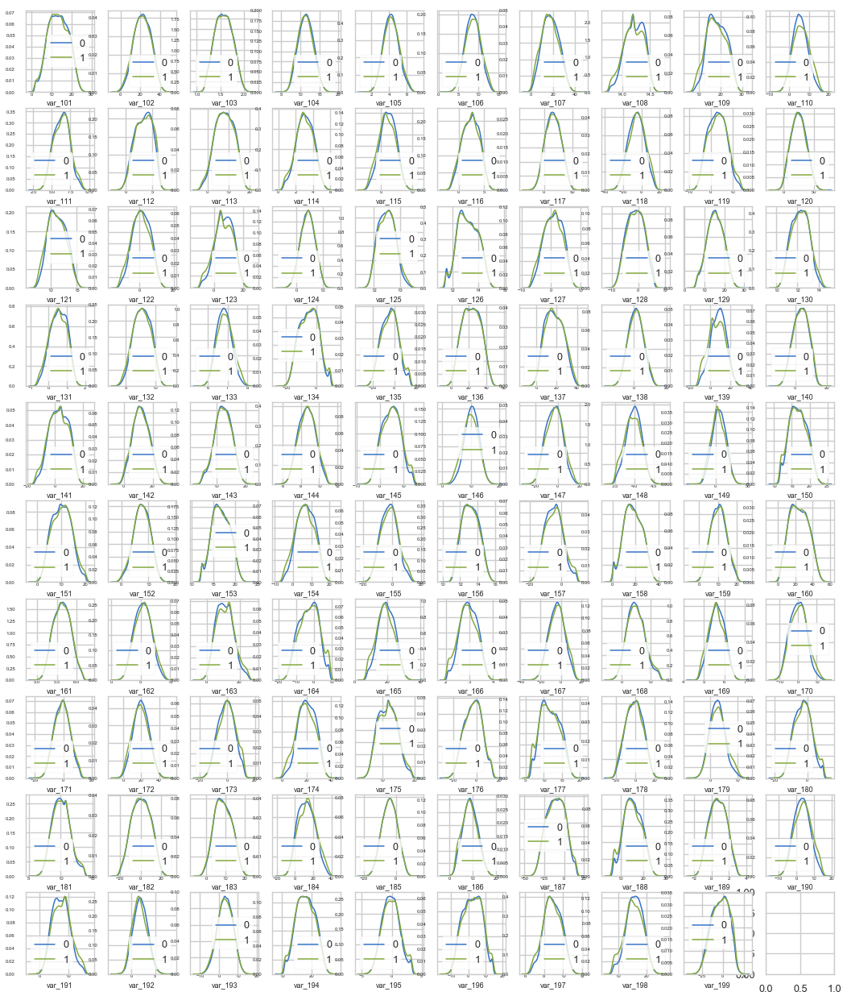
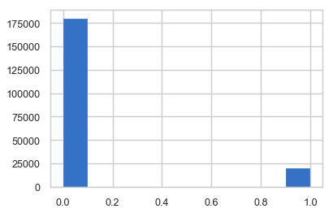
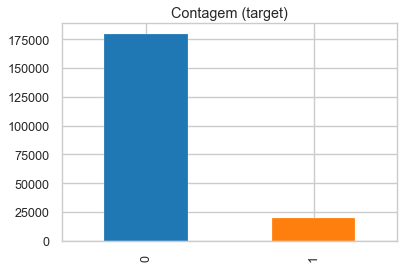
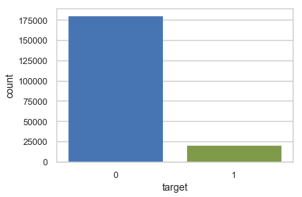
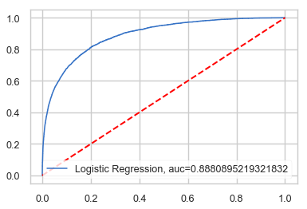
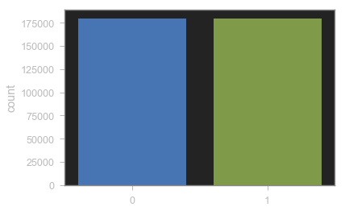
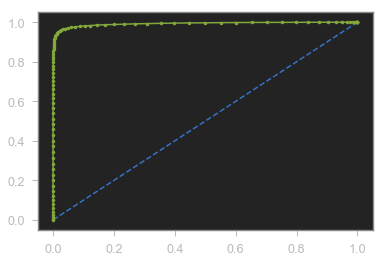

Link para o desafio:

https://www.kaggle.com/c/santander-customer-transaction-prediction/data


```python
import pandas as pd
import numpy as np
import matplotlib.pyplot as plt
import statsmodels.api as sm
import statsmodels.formula.api as smf
import sklearn.datasets as skd
import seaborn as sns
from imblearn.over_sampling import SMOTE
from sklearn.ensemble import ExtraTreesClassifier

import warnings
warnings.filterwarnings("ignore")
```


```python
# Importando o dataset de treino
df_TrainSantander = pd.read_csv('C:/Users/Manfredi/Google Drive/Digital House/Aulas/Módulo 3 - Machine Learning Introdutório/Desafio 03/santander-customer-transaction-prediction/train.csv', header=0) 
df_TesteSantander = pd.read_csv('C:/Users/Manfredi/Google Drive/Digital House/Aulas/Módulo 3 - Machine Learning Introdutório/Desafio 03/santander-customer-transaction-prediction/test.csv', header=0)
```


```python
# Olhando o formado do dataset
df_TrainSantander.head()
```


<div>
<style scoped>
    .dataframe tbody tr th:only-of-type {
        vertical-align: middle;
    }

    .dataframe tbody tr th {
        vertical-align: top;
    }

    .dataframe thead th {
        text-align: right;
    }
</style>
<table border="1" class="dataframe">
  <thead>
    <tr style="text-align: right;">
      <th></th>
      <th>ID_code</th>
      <th>target</th>
      <th>var_0</th>
      <th>var_1</th>
      <th>var_2</th>
      <th>var_3</th>
      <th>var_4</th>
      <th>var_5</th>
      <th>var_6</th>
      <th>var_7</th>
      <th>...</th>
      <th>var_190</th>
      <th>var_191</th>
      <th>var_192</th>
      <th>var_193</th>
      <th>var_194</th>
      <th>var_195</th>
      <th>var_196</th>
      <th>var_197</th>
      <th>var_198</th>
      <th>var_199</th>
    </tr>
  </thead>
  <tbody>
    <tr>
      <th>0</th>
      <td>train_0</td>
      <td>0</td>
      <td>8.9255</td>
      <td>-6.7863</td>
      <td>11.9081</td>
      <td>5.0930</td>
      <td>11.4607</td>
      <td>-9.2834</td>
      <td>5.1187</td>
      <td>18.6266</td>
      <td>...</td>
      <td>4.4354</td>
      <td>3.9642</td>
      <td>3.1364</td>
      <td>1.6910</td>
      <td>18.5227</td>
      <td>-2.3978</td>
      <td>7.8784</td>
      <td>8.5635</td>
      <td>12.7803</td>
      <td>-1.0914</td>
    </tr>
    <tr>
      <th>1</th>
      <td>train_1</td>
      <td>0</td>
      <td>11.5006</td>
      <td>-4.1473</td>
      <td>13.8588</td>
      <td>5.3890</td>
      <td>12.3622</td>
      <td>7.0433</td>
      <td>5.6208</td>
      <td>16.5338</td>
      <td>...</td>
      <td>7.6421</td>
      <td>7.7214</td>
      <td>2.5837</td>
      <td>10.9516</td>
      <td>15.4305</td>
      <td>2.0339</td>
      <td>8.1267</td>
      <td>8.7889</td>
      <td>18.3560</td>
      <td>1.9518</td>
    </tr>
    <tr>
      <th>2</th>
      <td>train_2</td>
      <td>0</td>
      <td>8.6093</td>
      <td>-2.7457</td>
      <td>12.0805</td>
      <td>7.8928</td>
      <td>10.5825</td>
      <td>-9.0837</td>
      <td>6.9427</td>
      <td>14.6155</td>
      <td>...</td>
      <td>2.9057</td>
      <td>9.7905</td>
      <td>1.6704</td>
      <td>1.6858</td>
      <td>21.6042</td>
      <td>3.1417</td>
      <td>-6.5213</td>
      <td>8.2675</td>
      <td>14.7222</td>
      <td>0.3965</td>
    </tr>
    <tr>
      <th>3</th>
      <td>train_3</td>
      <td>0</td>
      <td>11.0604</td>
      <td>-2.1518</td>
      <td>8.9522</td>
      <td>7.1957</td>
      <td>12.5846</td>
      <td>-1.8361</td>
      <td>5.8428</td>
      <td>14.9250</td>
      <td>...</td>
      <td>4.4666</td>
      <td>4.7433</td>
      <td>0.7178</td>
      <td>1.4214</td>
      <td>23.0347</td>
      <td>-1.2706</td>
      <td>-2.9275</td>
      <td>10.2922</td>
      <td>17.9697</td>
      <td>-8.9996</td>
    </tr>
    <tr>
      <th>4</th>
      <td>train_4</td>
      <td>0</td>
      <td>9.8369</td>
      <td>-1.4834</td>
      <td>12.8746</td>
      <td>6.6375</td>
      <td>12.2772</td>
      <td>2.4486</td>
      <td>5.9405</td>
      <td>19.2514</td>
      <td>...</td>
      <td>-1.4905</td>
      <td>9.5214</td>
      <td>-0.1508</td>
      <td>9.1942</td>
      <td>13.2876</td>
      <td>-1.5121</td>
      <td>3.9267</td>
      <td>9.5031</td>
      <td>17.9974</td>
      <td>-8.8104</td>
    </tr>
  </tbody>
</table>
<p>5 rows × 202 columns</p>
</div>


```python
df_TrainSantander.drop(columns=['ID_code'], inplace=True)
```


```python
df_TesteSantander.head()
```


<div>
<style scoped>
    .dataframe tbody tr th:only-of-type {
        vertical-align: middle;
    }

    .dataframe tbody tr th {
        vertical-align: top;
    }

    .dataframe thead th {
        text-align: right;
    }
</style>
<table border="1" class="dataframe">
  <thead>
    <tr style="text-align: right;">
      <th></th>
      <th>ID_code</th>
      <th>var_0</th>
      <th>var_1</th>
      <th>var_2</th>
      <th>var_3</th>
      <th>var_4</th>
      <th>var_5</th>
      <th>var_6</th>
      <th>var_7</th>
      <th>var_8</th>
      <th>...</th>
      <th>var_190</th>
      <th>var_191</th>
      <th>var_192</th>
      <th>var_193</th>
      <th>var_194</th>
      <th>var_195</th>
      <th>var_196</th>
      <th>var_197</th>
      <th>var_198</th>
      <th>var_199</th>
    </tr>
  </thead>
  <tbody>
    <tr>
      <th>0</th>
      <td>test_0</td>
      <td>11.0656</td>
      <td>7.7798</td>
      <td>12.9536</td>
      <td>9.4292</td>
      <td>11.4327</td>
      <td>-2.3805</td>
      <td>5.8493</td>
      <td>18.2675</td>
      <td>2.1337</td>
      <td>...</td>
      <td>-2.1556</td>
      <td>11.8495</td>
      <td>-1.4300</td>
      <td>2.4508</td>
      <td>13.7112</td>
      <td>2.4669</td>
      <td>4.3654</td>
      <td>10.7200</td>
      <td>15.4722</td>
      <td>-8.7197</td>
    </tr>
    <tr>
      <th>1</th>
      <td>test_1</td>
      <td>8.5304</td>
      <td>1.2543</td>
      <td>11.3047</td>
      <td>5.1858</td>
      <td>9.1974</td>
      <td>-4.0117</td>
      <td>6.0196</td>
      <td>18.6316</td>
      <td>-4.4131</td>
      <td>...</td>
      <td>10.6165</td>
      <td>8.8349</td>
      <td>0.9403</td>
      <td>10.1282</td>
      <td>15.5765</td>
      <td>0.4773</td>
      <td>-1.4852</td>
      <td>9.8714</td>
      <td>19.1293</td>
      <td>-20.9760</td>
    </tr>
    <tr>
      <th>2</th>
      <td>test_2</td>
      <td>5.4827</td>
      <td>-10.3581</td>
      <td>10.1407</td>
      <td>7.0479</td>
      <td>10.2628</td>
      <td>9.8052</td>
      <td>4.8950</td>
      <td>20.2537</td>
      <td>1.5233</td>
      <td>...</td>
      <td>-0.7484</td>
      <td>10.9935</td>
      <td>1.9803</td>
      <td>2.1800</td>
      <td>12.9813</td>
      <td>2.1281</td>
      <td>-7.1086</td>
      <td>7.0618</td>
      <td>19.8956</td>
      <td>-23.1794</td>
    </tr>
    <tr>
      <th>3</th>
      <td>test_3</td>
      <td>8.5374</td>
      <td>-1.3222</td>
      <td>12.0220</td>
      <td>6.5749</td>
      <td>8.8458</td>
      <td>3.1744</td>
      <td>4.9397</td>
      <td>20.5660</td>
      <td>3.3755</td>
      <td>...</td>
      <td>9.5702</td>
      <td>9.0766</td>
      <td>1.6580</td>
      <td>3.5813</td>
      <td>15.1874</td>
      <td>3.1656</td>
      <td>3.9567</td>
      <td>9.2295</td>
      <td>13.0168</td>
      <td>-4.2108</td>
    </tr>
    <tr>
      <th>4</th>
      <td>test_4</td>
      <td>11.7058</td>
      <td>-0.1327</td>
      <td>14.1295</td>
      <td>7.7506</td>
      <td>9.1035</td>
      <td>-8.5848</td>
      <td>6.8595</td>
      <td>10.6048</td>
      <td>2.9890</td>
      <td>...</td>
      <td>4.2259</td>
      <td>9.1723</td>
      <td>1.2835</td>
      <td>3.3778</td>
      <td>19.5542</td>
      <td>-0.2860</td>
      <td>-5.1612</td>
      <td>7.2882</td>
      <td>13.9260</td>
      <td>-9.1846</td>
    </tr>
  </tbody>
</table>
<p>5 rows × 201 columns</p>
</div>


```python
# Verificando se esxistem valores nulos

nulos = df_TrainSantander.isnull().sum().sort_values(ascending=False)
porcentagem = round(df_TrainSantander.isnull().sum().sort_values(ascending=False) / len(df_TrainSantander) * 100, 2)
pd.concat([nulos, porcentagem], axis= 1, keys= ['Qtd nulos', '%'])
```


<div>
<style scoped>
    .dataframe tbody tr th:only-of-type {
        vertical-align: middle;
    }

    .dataframe tbody tr th {
        vertical-align: top;
    }

    .dataframe thead th {
        text-align: right;
    }
</style>
<table border="1" class="dataframe">
  <thead>
    <tr style="text-align: right;">
      <th></th>
      <th>Qtd nulos</th>
      <th>%</th>
    </tr>
  </thead>
  <tbody>
    <tr>
      <th>var_199</th>
      <td>0</td>
      <td>0.0</td>
    </tr>
    <tr>
      <th>var_61</th>
      <td>0</td>
      <td>0.0</td>
    </tr>
    <tr>
      <th>var_71</th>
      <td>0</td>
      <td>0.0</td>
    </tr>
    <tr>
      <th>var_70</th>
      <td>0</td>
      <td>0.0</td>
    </tr>
    <tr>
      <th>var_69</th>
      <td>0</td>
      <td>0.0</td>
    </tr>
    <tr>
      <th>var_68</th>
      <td>0</td>
      <td>0.0</td>
    </tr>
    <tr>
      <th>var_67</th>
      <td>0</td>
      <td>0.0</td>
    </tr>
    <tr>
      <th>var_66</th>
      <td>0</td>
      <td>0.0</td>
    </tr>
    <tr>
      <th>var_65</th>
      <td>0</td>
      <td>0.0</td>
    </tr>
    <tr>
      <th>var_64</th>
      <td>0</td>
      <td>0.0</td>
    </tr>
    <tr>
      <th>var_63</th>
      <td>0</td>
      <td>0.0</td>
    </tr>
    <tr>
      <th>var_62</th>
      <td>0</td>
      <td>0.0</td>
    </tr>
    <tr>
      <th>var_60</th>
      <td>0</td>
      <td>0.0</td>
    </tr>
    <tr>
      <th>var_98</th>
      <td>0</td>
      <td>0.0</td>
    </tr>
    <tr>
      <th>var_59</th>
      <td>0</td>
      <td>0.0</td>
    </tr>
    <tr>
      <th>var_58</th>
      <td>0</td>
      <td>0.0</td>
    </tr>
    <tr>
      <th>var_57</th>
      <td>0</td>
      <td>0.0</td>
    </tr>
    <tr>
      <th>var_56</th>
      <td>0</td>
      <td>0.0</td>
    </tr>
    <tr>
      <th>var_55</th>
      <td>0</td>
      <td>0.0</td>
    </tr>
    <tr>
      <th>var_54</th>
      <td>0</td>
      <td>0.0</td>
    </tr>
    <tr>
      <th>var_53</th>
      <td>0</td>
      <td>0.0</td>
    </tr>
    <tr>
      <th>var_52</th>
      <td>0</td>
      <td>0.0</td>
    </tr>
    <tr>
      <th>var_51</th>
      <td>0</td>
      <td>0.0</td>
    </tr>
    <tr>
      <th>var_50</th>
      <td>0</td>
      <td>0.0</td>
    </tr>
    <tr>
      <th>var_72</th>
      <td>0</td>
      <td>0.0</td>
    </tr>
    <tr>
      <th>var_73</th>
      <td>0</td>
      <td>0.0</td>
    </tr>
    <tr>
      <th>var_74</th>
      <td>0</td>
      <td>0.0</td>
    </tr>
    <tr>
      <th>var_75</th>
      <td>0</td>
      <td>0.0</td>
    </tr>
    <tr>
      <th>var_96</th>
      <td>0</td>
      <td>0.0</td>
    </tr>
    <tr>
      <th>var_95</th>
      <td>0</td>
      <td>0.0</td>
    </tr>
    <tr>
      <th>...</th>
      <td>...</td>
      <td>...</td>
    </tr>
    <tr>
      <th>var_104</th>
      <td>0</td>
      <td>0.0</td>
    </tr>
    <tr>
      <th>var_103</th>
      <td>0</td>
      <td>0.0</td>
    </tr>
    <tr>
      <th>var_102</th>
      <td>0</td>
      <td>0.0</td>
    </tr>
    <tr>
      <th>var_101</th>
      <td>0</td>
      <td>0.0</td>
    </tr>
    <tr>
      <th>var_122</th>
      <td>0</td>
      <td>0.0</td>
    </tr>
    <tr>
      <th>var_124</th>
      <td>0</td>
      <td>0.0</td>
    </tr>
    <tr>
      <th>var_147</th>
      <td>0</td>
      <td>0.0</td>
    </tr>
    <tr>
      <th>var_125</th>
      <td>0</td>
      <td>0.0</td>
    </tr>
    <tr>
      <th>var_146</th>
      <td>0</td>
      <td>0.0</td>
    </tr>
    <tr>
      <th>var_145</th>
      <td>0</td>
      <td>0.0</td>
    </tr>
    <tr>
      <th>var_144</th>
      <td>0</td>
      <td>0.0</td>
    </tr>
    <tr>
      <th>var_143</th>
      <td>0</td>
      <td>0.0</td>
    </tr>
    <tr>
      <th>var_142</th>
      <td>0</td>
      <td>0.0</td>
    </tr>
    <tr>
      <th>var_141</th>
      <td>0</td>
      <td>0.0</td>
    </tr>
    <tr>
      <th>var_140</th>
      <td>0</td>
      <td>0.0</td>
    </tr>
    <tr>
      <th>var_139</th>
      <td>0</td>
      <td>0.0</td>
    </tr>
    <tr>
      <th>var_138</th>
      <td>0</td>
      <td>0.0</td>
    </tr>
    <tr>
      <th>var_137</th>
      <td>0</td>
      <td>0.0</td>
    </tr>
    <tr>
      <th>var_136</th>
      <td>0</td>
      <td>0.0</td>
    </tr>
    <tr>
      <th>var_135</th>
      <td>0</td>
      <td>0.0</td>
    </tr>
    <tr>
      <th>var_134</th>
      <td>0</td>
      <td>0.0</td>
    </tr>
    <tr>
      <th>var_133</th>
      <td>0</td>
      <td>0.0</td>
    </tr>
    <tr>
      <th>var_132</th>
      <td>0</td>
      <td>0.0</td>
    </tr>
    <tr>
      <th>var_131</th>
      <td>0</td>
      <td>0.0</td>
    </tr>
    <tr>
      <th>var_130</th>
      <td>0</td>
      <td>0.0</td>
    </tr>
    <tr>
      <th>var_129</th>
      <td>0</td>
      <td>0.0</td>
    </tr>
    <tr>
      <th>var_128</th>
      <td>0</td>
      <td>0.0</td>
    </tr>
    <tr>
      <th>var_127</th>
      <td>0</td>
      <td>0.0</td>
    </tr>
    <tr>
      <th>var_126</th>
      <td>0</td>
      <td>0.0</td>
    </tr>
    <tr>
      <th>target</th>
      <td>0</td>
      <td>0.0</td>
    </tr>
  </tbody>
</table>
<p>201 rows × 2 columns</p>
</div>


```python
# Criando uma função para facilitar a plotagem de todas as features

def plot_feature_distribution(df1, df2, label1, label2, features):
    i = 0
    sns.set_style('whitegrid')
    plt.figure()
    fig, ax = plt.subplots(10,10,figsize=(18,22))

    for feature in features:
        i += 1
        plt.subplot(10,10,i)
        sns.distplot(df1[feature], hist=False,label=label1)
        sns.distplot(df2[feature], hist=False,label=label2)
        plt.xlabel(feature, fontsize=9)
        locs, labels = plt.xticks()
        plt.tick_params(axis='x', which='major', labelsize=6, pad=-6)
        plt.tick_params(axis='y', which='major', labelsize=6)
    plt.show();
```


```python
# Plotagem das distribuições das 100 primeiras features considerando a variavel target
t0 = df_TrainSantander.loc[df_TrainSantander['target'] == 0]
t1 = df_TrainSantander.loc[df_TrainSantander['target'] == 1]
features = df_TrainSantander.columns.values[2:102]
plot_feature_distribution(t0, t1, '0', '1', features)
```


    <Figure size 432x288 with 0 Axes>





```python
# Plotagem das 100 reastantes
features = df_TrainSantander.columns.values[102: 202]
plot_feature_distribution(t0, t1, '0', '1', features)
```


    <Figure size 432x288 with 0 Axes>





```python
# Observado a distribuições da variavel target
plt.hist(df_TrainSantander['target'])
```


    (array([179902.,      0.,      0.,      0.,      0.,      0.,      0.,
                 0.,      0.,  20098.]),
     array([0. , 0.1, 0.2, 0.3, 0.4, 0.5, 0.6, 0.7, 0.8, 0.9, 1. ]),
     <a list of 10 Patch objects>)





```python
# Outra forma de observar a quantidade de 0s e 1s
target_count = df_TrainSantander.target.value_counts()
print('Class 0:', target_count[0])
print('Class 1:', target_count[1])
print('Proporção:', round(target_count[1] / target_count[0], 5))

target_count.plot(kind='bar', title='Contagem (target)', color=['#1F77B4', '#FF7F0E'])
```

    Class 0: 179902
    Class 1: 20098
    Proporção: 0.11172
    


    <matplotlib.axes._subplots.AxesSubplot at 0x2a64f7fc128>





```python
sns.countplot(df_TrainSantander['target'])
```


    <matplotlib.axes._subplots.AxesSubplot at 0x2a64fa7dda0>





```python
# criando uma cópia do dataframe de treino
df_TrainSantander_copy = df_TrainSantander.copy(deep=True)
```


```python
X = np.array(df_TrainSantander_copy.ix[:, df_TrainSantander_copy.columns != 'target'])
y = np.array(df_TrainSantander_copy.ix[:, df_TrainSantander_copy.columns == 'target'])
print(f'Shape X: {X.shape}: ')
print(f'Shape y: {y.shape}')
```

    Shape X: (200000, 200): 
    Shape y: (200000, 1)
    


```python
from imblearn.over_sampling import SMOTE

from sklearn.model_selection import train_test_split

X_train, X_test, y_train, y_test = train_test_split(X, y, test_size=0.3, random_state=0)

print(f'Número de registros de X_train: {X_train.shape}')
print(f'Número de registros de y_train: {y_train.shape}')
print(f'Número de registros de X_teste: {X_test.shape}')
print(f'Número de registros de y_teste: {y_test.shape}')
```

    Número de registros de X_train: (140000, 200)
    Número de registros de y_train: (140000, 1)
    Número de registros de X_teste: (60000, 200)
    Número de registros de y_teste: (60000, 1)
    


```python
# Colocando os dados na mesma escala
from sklearn.preprocessing import StandardScaler
# instanciando
sc = StandardScaler()
# transformando os dados
X = sc.fit_transform(X)
```


```python
X_train, X_test, y_train, y_test = train_test_split(X, y, test_size = 0.2, random_state=42)
```


```python
# Elaborando função para inicio do processo de Data Compreension

def check_feature_importance(X, y):

        forest = ExtraTreesClassifier(
            verbose=True,
            n_estimators=10,
            random_state=42,
            n_jobs=-1
        )

        forest.fit(X, np.ravel(y))
        importances = forest.feature_importances_


        df_importances = pd.DataFrame(
            data=dict(
                variable=[i for i in range(200)],
                importance=importances
            )
        )

        df_importances['treshold'] = df_importances['importance'].mean()

        select = SelectFromModel(forest, prefit=True)
        selected_features = X.columns[(select.get_support())]

        df_selected_features = pd.DataFrame(
            data=select.transform(X),
            columns=selected_features
        )

        return df_selected_features, df_importances
```


```python
target = df_TrainSantander['target']
train = df_TrainSantander.drop(["target"], axis=1)
```


```python
from sklearn.feature_selection import SelectFromModel
df_selected_features, df_importances = check_feature_importance(X=train, y=target)
```

    [Parallel(n_jobs=-1)]: Using backend ThreadingBackend with 8 concurrent workers.
    [Parallel(n_jobs=-1)]: Done   6 out of  10 | elapsed:    2.6s remaining:    1.7s
    [Parallel(n_jobs=-1)]: Done  10 out of  10 | elapsed:    3.7s finished
    


```python
df_selected_features.head()
```


<div>
<style scoped>
    .dataframe tbody tr th:only-of-type {
        vertical-align: middle;
    }

    .dataframe tbody tr th {
        vertical-align: top;
    }

    .dataframe thead th {
        text-align: right;
    }
</style>
<table border="1" class="dataframe">
  <thead>
    <tr style="text-align: right;">
      <th></th>
      <th>var_0</th>
      <th>var_1</th>
      <th>var_2</th>
      <th>var_5</th>
      <th>var_6</th>
      <th>var_9</th>
      <th>var_12</th>
      <th>var_13</th>
      <th>var_18</th>
      <th>var_21</th>
      <th>...</th>
      <th>var_173</th>
      <th>var_174</th>
      <th>var_177</th>
      <th>var_179</th>
      <th>var_184</th>
      <th>var_188</th>
      <th>var_190</th>
      <th>var_191</th>
      <th>var_197</th>
      <th>var_198</th>
    </tr>
  </thead>
  <tbody>
    <tr>
      <th>0</th>
      <td>8.9255</td>
      <td>-6.7863</td>
      <td>11.9081</td>
      <td>-9.2834</td>
      <td>5.1187</td>
      <td>5.7470</td>
      <td>14.0137</td>
      <td>0.5745</td>
      <td>4.2840</td>
      <td>16.2191</td>
      <td>...</td>
      <td>3.1531</td>
      <td>18.5618</td>
      <td>13.7241</td>
      <td>1.7202</td>
      <td>25.8398</td>
      <td>17.5743</td>
      <td>4.4354</td>
      <td>3.9642</td>
      <td>8.5635</td>
      <td>12.7803</td>
    </tr>
    <tr>
      <th>1</th>
      <td>11.5006</td>
      <td>-4.1473</td>
      <td>13.8588</td>
      <td>7.0433</td>
      <td>5.6208</td>
      <td>8.0851</td>
      <td>14.0239</td>
      <td>8.4135</td>
      <td>7.8000</td>
      <td>2.7407</td>
      <td>...</td>
      <td>5.5134</td>
      <td>30.2645</td>
      <td>16.5721</td>
      <td>11.0752</td>
      <td>22.5441</td>
      <td>13.3175</td>
      <td>7.6421</td>
      <td>7.7214</td>
      <td>8.7889</td>
      <td>18.3560</td>
    </tr>
    <tr>
      <th>2</th>
      <td>8.6093</td>
      <td>-2.7457</td>
      <td>12.0805</td>
      <td>-9.0837</td>
      <td>6.9427</td>
      <td>5.9525</td>
      <td>14.1929</td>
      <td>7.3124</td>
      <td>4.7011</td>
      <td>18.1377</td>
      <td>...</td>
      <td>-5.8234</td>
      <td>25.6820</td>
      <td>8.8438</td>
      <td>2.4013</td>
      <td>23.0866</td>
      <td>10.1934</td>
      <td>2.9057</td>
      <td>9.7905</td>
      <td>8.2675</td>
      <td>14.7222</td>
    </tr>
    <tr>
      <th>3</th>
      <td>11.0604</td>
      <td>-2.1518</td>
      <td>8.9522</td>
      <td>-1.8361</td>
      <td>5.8428</td>
      <td>8.2450</td>
      <td>13.8463</td>
      <td>11.9704</td>
      <td>15.9426</td>
      <td>12.5579</td>
      <td>...</td>
      <td>11.7134</td>
      <td>14.7483</td>
      <td>13.9552</td>
      <td>5.6961</td>
      <td>-0.4639</td>
      <td>12.4124</td>
      <td>4.4666</td>
      <td>4.7433</td>
      <td>10.2922</td>
      <td>17.9697</td>
    </tr>
    <tr>
      <th>4</th>
      <td>9.8369</td>
      <td>-1.4834</td>
      <td>12.8746</td>
      <td>2.4486</td>
      <td>5.9405</td>
      <td>7.6784</td>
      <td>13.8481</td>
      <td>7.8895</td>
      <td>6.5263</td>
      <td>18.9608</td>
      <td>...</td>
      <td>2.3705</td>
      <td>18.4685</td>
      <td>13.5261</td>
      <td>5.1743</td>
      <td>11.8503</td>
      <td>16.0201</td>
      <td>-1.4905</td>
      <td>9.5214</td>
      <td>9.5031</td>
      <td>17.9974</td>
    </tr>
  </tbody>
</table>
<p>5 rows × 74 columns</p>
</div>


```python
X = df_selected_features
```


```python
X.info()
```

    <class 'pandas.core.frame.DataFrame'>
    RangeIndex: 200000 entries, 0 to 199999
    Data columns (total 74 columns):
    var_0      200000 non-null float64
    var_1      200000 non-null float64
    var_2      200000 non-null float64
    var_5      200000 non-null float64
    var_6      200000 non-null float64
    var_9      200000 non-null float64
    var_12     200000 non-null float64
    var_13     200000 non-null float64
    var_18     200000 non-null float64
    var_21     200000 non-null float64
    var_22     200000 non-null float64
    var_26     200000 non-null float64
    var_33     200000 non-null float64
    var_34     200000 non-null float64
    var_40     200000 non-null float64
    var_44     200000 non-null float64
    var_52     200000 non-null float64
    var_53     200000 non-null float64
    var_56     200000 non-null float64
    var_67     200000 non-null float64
    var_75     200000 non-null float64
    var_76     200000 non-null float64
    var_78     200000 non-null float64
    var_80     200000 non-null float64
    var_81     200000 non-null float64
    var_86     200000 non-null float64
    var_87     200000 non-null float64
    var_89     200000 non-null float64
    var_91     200000 non-null float64
    var_92     200000 non-null float64
    var_93     200000 non-null float64
    var_94     200000 non-null float64
    var_95     200000 non-null float64
    var_99     200000 non-null float64
    var_106    200000 non-null float64
    var_107    200000 non-null float64
    var_108    200000 non-null float64
    var_109    200000 non-null float64
    var_110    200000 non-null float64
    var_114    200000 non-null float64
    var_115    200000 non-null float64
    var_121    200000 non-null float64
    var_122    200000 non-null float64
    var_123    200000 non-null float64
    var_125    200000 non-null float64
    var_127    200000 non-null float64
    var_130    200000 non-null float64
    var_133    200000 non-null float64
    var_135    200000 non-null float64
    var_139    200000 non-null float64
    var_146    200000 non-null float64
    var_147    200000 non-null float64
    var_148    200000 non-null float64
    var_154    200000 non-null float64
    var_155    200000 non-null float64
    var_157    200000 non-null float64
    var_162    200000 non-null float64
    var_163    200000 non-null float64
    var_164    200000 non-null float64
    var_165    200000 non-null float64
    var_166    200000 non-null float64
    var_169    200000 non-null float64
    var_170    200000 non-null float64
    var_172    200000 non-null float64
    var_173    200000 non-null float64
    var_174    200000 non-null float64
    var_177    200000 non-null float64
    var_179    200000 non-null float64
    var_184    200000 non-null float64
    var_188    200000 non-null float64
    var_190    200000 non-null float64
    var_191    200000 non-null float64
    var_197    200000 non-null float64
    var_198    200000 non-null float64
    dtypes: float64(74)
    memory usage: 112.9 MB
    


```python
from sklearn import metrics
```


```python
# importando a biblioteca
from sklearn.naive_bayes import GaussianNB
# instanciando o modelo
clf = GaussianNB()
# ajustando o modelo
clf.fit(X_train, y_train)

# imprimindo o resultado do modelo
print('--- Results ---')
y_pred = clf.predict(X_test)
print("Accuracy: ", metrics.accuracy_score(y_test, y_pred))
print("Precision: ", metrics.precision_score(y_test, y_pred))
print("Recall: ", metrics.recall_score(y_test, y_pred))
```

    --- Results ---
    Accuracy:  0.9209
    Precision:  0.7195294117647059
    Recall:  0.37319990236758604
    


```python
# Calculando a matriz de confusão
from sklearn.metrics import confusion_matrix
confusion_matrix(y_test, y_pred)
```


    array([[35307,   596],
           [ 2568,  1529]], dtype=int64)


```python
# plotando a curva ROC
y_pred_proba = clf.predict_proba(X_test)[::,1]
fpr, tpr, _ = metrics.roc_curve(y_test,  y_pred_proba)
auc = metrics.roc_auc_score(y_test, y_pred_proba)
plt.plot(fpr,tpr,label="Logistic Regression, auc="+str(auc))
plt.plot([0, 1], [0, 1], color='red', lw=2, linestyle='--')
plt.legend(loc=4)
```


    <matplotlib.legend.Legend at 0x2a61f355b38>





```python
# colocando na mesma escala
df_TesteSantander = df_TesteSantander.drop(columns=['ID_code'])
# transformando os dados de teste
df_TesteSantander = sc.transform(df_TesteSantander)
df_TesteSantander
```


    array([[ 11.0656,   7.7798,  12.9536, ...,  10.72  ,  15.4722,  -8.7197],
           [  8.5304,   1.2543,  11.3047, ...,   9.8714,  19.1293, -20.976 ],
           [  5.4827, -10.3581,  10.1407, ...,   7.0618,  19.8956, -23.1794],
           ...,
           [ 11.636 ,   2.2769,  11.2074, ...,   9.1933,  11.7905, -22.2762],
           [ 13.5745,  -0.5134,  13.6584, ...,   8.1079,   8.7735,  -0.2122],
           [ 10.4664,   1.807 ,  10.2277, ...,  10.3378,  14.334 ,  -7.7094]])


```python
y_pred_proba = clf.predict_proba(df_TesteSantander)
df_TesteSantander.shape
```


    (200000, 200)


```python
df_submission = pd.DataFrame(
            data=dict(
                ID_code=['test_{:}'.format(i) for i in range(df_TesteSantander.shape[0])],
                target=y_pred_proba[:, 1],
            ),
        )

df_submission.shape
```


    (200000, 2)


```python
df_submission.to_csv("submission_3.csv", index=False)
```


```python

```


```python
# Criando um dataframe sem a variavel target
X_resampled = dfraw[dfraw.columns.difference(['ID_code', 'target'])]
X_resampled.head()
```


<div>
<style scoped>
    .dataframe tbody tr th:only-of-type {
        vertical-align: middle;
    }

    .dataframe tbody tr th {
        vertical-align: top;
    }

    .dataframe thead th {
        text-align: right;
    }
</style>
<table border="1" class="dataframe">
  <thead>
    <tr style="text-align: right;">
      <th></th>
      <th>var_0</th>
      <th>var_1</th>
      <th>var_10</th>
      <th>var_100</th>
      <th>var_101</th>
      <th>var_102</th>
      <th>var_103</th>
      <th>var_104</th>
      <th>var_105</th>
      <th>var_106</th>
      <th>...</th>
      <th>var_90</th>
      <th>var_91</th>
      <th>var_92</th>
      <th>var_93</th>
      <th>var_94</th>
      <th>var_95</th>
      <th>var_96</th>
      <th>var_97</th>
      <th>var_98</th>
      <th>var_99</th>
    </tr>
  </thead>
  <tbody>
    <tr>
      <th>0</th>
      <td>8.9255</td>
      <td>-6.7863</td>
      <td>2.9252</td>
      <td>9.4763</td>
      <td>13.3102</td>
      <td>26.5376</td>
      <td>1.4403</td>
      <td>14.7100</td>
      <td>6.0454</td>
      <td>9.5426</td>
      <td>...</td>
      <td>-21.4494</td>
      <td>6.7806</td>
      <td>11.0924</td>
      <td>9.9913</td>
      <td>14.8421</td>
      <td>0.1812</td>
      <td>8.9642</td>
      <td>16.2572</td>
      <td>2.1743</td>
      <td>-3.4132</td>
    </tr>
    <tr>
      <th>1</th>
      <td>11.5006</td>
      <td>-4.1473</td>
      <td>-0.4032</td>
      <td>-13.6950</td>
      <td>8.4068</td>
      <td>35.4734</td>
      <td>1.7093</td>
      <td>15.1866</td>
      <td>2.6227</td>
      <td>7.3412</td>
      <td>...</td>
      <td>0.4768</td>
      <td>6.8852</td>
      <td>8.0905</td>
      <td>10.9631</td>
      <td>11.7569</td>
      <td>-1.2722</td>
      <td>24.7876</td>
      <td>26.6881</td>
      <td>1.8944</td>
      <td>0.6939</td>
    </tr>
    <tr>
      <th>2</th>
      <td>8.6093</td>
      <td>-2.7457</td>
      <td>-0.3249</td>
      <td>-0.3939</td>
      <td>12.6317</td>
      <td>14.8863</td>
      <td>1.3854</td>
      <td>15.0284</td>
      <td>3.9995</td>
      <td>5.3683</td>
      <td>...</td>
      <td>-22.4038</td>
      <td>7.0883</td>
      <td>14.1613</td>
      <td>10.5080</td>
      <td>14.2621</td>
      <td>0.2647</td>
      <td>20.4031</td>
      <td>17.0360</td>
      <td>1.6981</td>
      <td>-0.0269</td>
    </tr>
    <tr>
      <th>3</th>
      <td>11.0604</td>
      <td>-2.1518</td>
      <td>2.3061</td>
      <td>-19.8592</td>
      <td>22.5316</td>
      <td>18.6129</td>
      <td>1.3512</td>
      <td>9.3291</td>
      <td>4.2835</td>
      <td>10.3907</td>
      <td>...</td>
      <td>-7.5866</td>
      <td>7.0364</td>
      <td>14.4027</td>
      <td>10.7795</td>
      <td>7.2887</td>
      <td>-1.0930</td>
      <td>11.3596</td>
      <td>18.1486</td>
      <td>2.8344</td>
      <td>1.9480</td>
    </tr>
    <tr>
      <th>4</th>
      <td>9.8369</td>
      <td>-1.4834</td>
      <td>-9.4458</td>
      <td>-22.9264</td>
      <td>12.3562</td>
      <td>17.3410</td>
      <td>1.6940</td>
      <td>7.1179</td>
      <td>5.1934</td>
      <td>8.8230</td>
      <td>...</td>
      <td>-39.7997</td>
      <td>7.0065</td>
      <td>9.3627</td>
      <td>10.4316</td>
      <td>14.0553</td>
      <td>0.0213</td>
      <td>14.7246</td>
      <td>35.2988</td>
      <td>1.6844</td>
      <td>0.6715</td>
    </tr>
  </tbody>
</table>
<p>5 rows × 200 columns</p>
</div>


```python
# criando um dataframe apenas com a variavel target
y_resampled = dfraw[['target']]
y_resampled.head()
```


<div>
<style scoped>
    .dataframe tbody tr th:only-of-type {
        vertical-align: middle;
    }

    .dataframe tbody tr th {
        vertical-align: top;
    }

    .dataframe thead th {
        text-align: right;
    }
</style>
<table border="1" class="dataframe">
  <thead>
    <tr style="text-align: right;">
      <th></th>
      <th>target</th>
    </tr>
  </thead>
  <tbody>
    <tr>
      <th>0</th>
      <td>0</td>
    </tr>
    <tr>
      <th>1</th>
      <td>0</td>
    </tr>
    <tr>
      <th>2</th>
      <td>0</td>
    </tr>
    <tr>
      <th>3</th>
      <td>0</td>
    </tr>
    <tr>
      <th>4</th>
      <td>0</td>
    </tr>
  </tbody>
</table>
</div>


```python
# contando a quantidade de 0s e 1s antes de fazer o oversampling
y_resampled['target'].value_counts()
```


    0    179902
    1     20098
    Name: target, dtype: int64


```python
# Foi preciso separar dividir as colunas do dataframe porque o método SMOTE pede isso
X_resampled, y_resampled = SMOTE(n_jobs=-1).fit_resample(X_resampled, y_resampled)
```

    C:\Users\Manfredi\Anaconda3\lib\site-packages\sklearn\utils\validation.py:724: DataConversionWarning: A column-vector y was passed when a 1d array was expected. Please change the shape of y to (n_samples, ), for example using ravel().
      y = column_or_1d(y, warn=True)
    


```python
# Contando a quantidade de 0s e 1s após o oversampling
from collections import Counter
print(sorted(Counter(y_resampled).items()))
```

    [(0, 179902), (1, 179902)]
    


```python
# Plotando a quantidade de 0s e 1s
sns.countplot(y_resampled)
```


    <matplotlib.axes._subplots.AxesSubplot at 0x1ce83468a58>





```python
# dividindo o data set de treino e de teste em 80% 20%
from sklearn.model_selection import train_test_split
X_train, X_test, y_train, y_test = train_test_split(X_resampled, y_resampled, random_state=0, stratify=y_resampled)
```


```python
# Treinando o algoritimo com os dados de treino mesmo
from sklearn.ensemble import RandomForestClassifier

# Instanciando o modelo
classifier = RandomForestClassifier(n_estimators=100, n_jobs=-1)
# Ajustando o modelo
classifier.fit(X_train, y_train)
# Predição de valores com o arquivo de TESTE
y_pred = classifier.predict(X_test)
```


```python
# VERIFICANDO AS METRICAS DO DATASET DE TREINO
from sklearn.metrics import classification_report, confusion_matrix, accuracy_score

print(confusion_matrix(y_test, y_pred))
print(classification_report(y_test, y_pred))
print(accuracy_score(y_test, y_pred))
```

    [[44349   627]
     [ 2444 42531]]
                  precision    recall  f1-score   support
    
               0       0.95      0.99      0.97     44976
               1       0.99      0.95      0.97     44975
    
        accuracy                           0.97     89951
       macro avg       0.97      0.97      0.97     89951
    weighted avg       0.97      0.97      0.97     89951
    
    0.9658591900034463
    


```python
# Predizendo as probabilidades do dataset de treino
probs = classifier.predict_proba(X_test)
probs = probs[:, 1]
```


```python
# Calculando a AUC do dataset de treino
from sklearn.metrics import roc_curve
from sklearn.metrics import roc_auc_score

auc = roc_auc_score(y_test, probs)
print('AUC: %.3f' % auc)
```

    AUC: 0.992
    


```python
# PLOTANDO A CURVA ROC DO DATASET DE TREINO
from matplotlib import pyplot
# Calculando a curva roc
fpr, tpr, score = roc_curve(y_test, probs)

pyplot.plot([0, 1], [0, 1], linestyle='--')

# Plotando a curva ROC do modelo
pyplot.plot(fpr, tpr, marker='.')
pyplot.show()
```





```python

```


```python
# Carregando o dataset de treino
dfteste = pd.read_csv('C:/Users/Manfredi/Google Drive/Digital House/Aulas/Módulo 3 - Machine Learning Introdutório/Desafio 03/santander-customer-transaction-prediction/test.csv')    
dfteste.drop(columns='ID_code', inplace=True)
```


```python
# Treinando o algoritimo com dataset de treino
from sklearn.ensemble import RandomForestClassifier

# Instanciando o modelo
classifier = RandomForestClassifier(n_estimators=100, n_jobs=-1)
# Ajustando o modelo
classifier.fit(X_train, y_train)
# Predição de valores com o arquivo de TESTE
y_pred_teste = classifier.predict(dfteste)
```


```python
df_ypred = pd.DataFrame(
        data=dict(
            ID_code=['test_{:}'.format(i) for i in range(len(y_pred_tested_teste))],
            target=y_pred_teste,
        ),
    )
```


```python
y_pred_teste
```


    array([0, 0, 1, ..., 0, 0, 0], dtype=int64)


```python
# Valores preditos do dataset de treino e jogando em um arquivo csv para upar no Kaggle
y_pred_teste.to_csv(r'C:\Users\Manfredi\Google Drive\Digital House\Aulas\Módulo 3 - Machine Learning Introdutório\Desafio 03\santander-customer-transaction-prediction\submission_1.csv'
             ,index=False)
```


```python
# Valores preditos de probabilidade em cima do dataset de teste
probsteste = classifier.predict_proba(dfteste)
```


```python
# Pegando apenas as probabilidades de 1
y_pred_prob_teste = probsteste[:, 1]
```


```python
# Criando um dataframe com as probabildades de 1
df_pred_proba_teste = pd.DataFrame(
        data=dict(
            ID_code=['test_{:}'.format(i) for i in range(len(y_pred_prob_teste))],
            target=y_pred_prob_teste,
        ),
    )
```


```python
# Criando um arquivo csv
df_pred_proba_teste.to_csv(r'C:\Users\Manfredi\Google Drive\Digital House\Aulas\Módulo 3 - Machine Learning Introdutório\Desafio 03\santander-customer-transaction-prediction\submission_2.csv'
             ,index=False)
```


```python
# Treinando o algoritmo com uma regressão Logistica
# Importando o modelo
from sklearn.linear_model import LogisticRegression
# Instanciando o modelo
logistic_classifier = LogisticRegression(n_jobs=8, random_state=0)
# Ajustando o modelo
logistic_classifier.fit(X_train, y_train)
# Predição dos valores
logistic_classifier.predict(X_test)
```

    C:\Users\Manfredi\Anaconda3\lib\site-packages\sklearn\linear_model\logistic.py:432: FutureWarning: Default solver will be changed to 'lbfgs' in 0.22. Specify a solver to silence this warning.
      FutureWarning)
    C:\Users\Manfredi\Anaconda3\lib\site-packages\sklearn\linear_model\logistic.py:1544: UserWarning: 'n_jobs' > 1 does not have any effect when 'solver' is set to 'liblinear'. Got 'n_jobs' = 8.
      " = {}.".format(effective_n_jobs(self.n_jobs)))
    


    array([1, 1, 0, ..., 0, 1, 1], dtype=int64)


```python
# Predição de valores com o dataset de teste
y_pred_logistic = logistic_classifier.predict(dfteste)
#print('Accuracy of logistic regression classifier on test set: {:.2f}'.format(logistic_classifier.score(y_pred_logistic)))
```


```python
print('Accuracy of logistic regression classifier on test set: {:.2f}'.format(logistic_classifier.score(X_test, y_pred_logistic)))
```


    ---------------------------------------------------------------------------

    ValueError                                Traceback (most recent call last)

    <ipython-input-42-8eeb4d4f012f> in <module>
    ----> 1 print('Accuracy of logistic regression classifier on test set: {:.2f}'.format(logistic_classifier.score(X_test, y_pred_logistic)))
    

    ~\Anaconda3\lib\site-packages\sklearn\base.py in score(self, X, y, sample_weight)
        355         """
        356         from .metrics import accuracy_score
    --> 357         return accuracy_score(y, self.predict(X), sample_weight=sample_weight)
        358 
        359 
    

    ~\Anaconda3\lib\site-packages\sklearn\metrics\classification.py in accuracy_score(y_true, y_pred, normalize, sample_weight)
        174 
        175     # Compute accuracy for each possible representation
    --> 176     y_type, y_true, y_pred = _check_targets(y_true, y_pred)
        177     check_consistent_length(y_true, y_pred, sample_weight)
        178     if y_type.startswith('multilabel'):
    

    ~\Anaconda3\lib\site-packages\sklearn\metrics\classification.py in _check_targets(y_true, y_pred)
         69     y_pred : array or indicator matrix
         70     """
    ---> 71     check_consistent_length(y_true, y_pred)
         72     type_true = type_of_target(y_true)
         73     type_pred = type_of_target(y_pred)
    

    ~\Anaconda3\lib\site-packages\sklearn\utils\validation.py in check_consistent_length(*arrays)
        203     if len(uniques) > 1:
        204         raise ValueError("Found input variables with inconsistent numbers of"
    --> 205                          " samples: %r" % [int(l) for l in lengths])
        206 
        207 
    

    ValueError: Found input variables with inconsistent numbers of samples: [200000, 89951]


```python

```


```python

```
